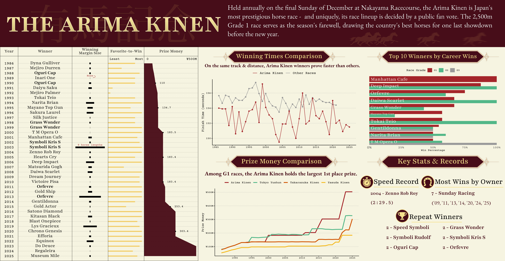

# EDS 240: Final Project - Data Infographic

## About

This repository contains the final project materials for the course EDS 240 - Data Visualization at UCSB's Masters of Environmental Data Science. The project's main goal is to practice data visualizations skills on a dataset of our choice.

## Contents

**inspo**

- Folder containing two data visualizations to gain inspiration from & hand-drawn, brainstormed visuals.

**scripts**

- [clean_translate.R](scripts/clean_translate.R)

    - Used to translate the Japanese columns of the original data. Also calls *parse_margin.R* to convert margin column to numerical.
    - **Output**: Clean dataframe with English columns.

- [parse_margin.R](scripts/parse_margin.R)

    - Function written to parse margin column in original data. Handles & converts margin values like "クビ, "アタマ", "1.1/2", etc., to numeric values, which represent margins between horses in a single race.

**exploration.qmd**

- Quarto doc containing the initial data exploring and initial plots. Mainly used to brainstorm ideas for the final infographic.

**drafting-viz.qmd**

- Quarto doc containing further progress for infographic visuals after deciding to narrow the project focus to one horserace, the Arima Kinen.

## Final Infographic

More information on this infographic exists in [this blogpost](https://zachyyy700.github.io/posts/2026-2-26-infographic/) on my personal website.

## Data

- Horse race data was sourced from [netkeiba](https://www.netkeiba.com/), a website that hosts official Japan Racing Association (JRA) data. This was done by a user on [Kaggle](https://www.kaggle.com/), an online data science community where users can find and publish datasets. The user who published this horse racing data used web-scraping tools to assimilate the race results data used in the analysis. More information can be found on Kaggle at the user's [public dataset post](https://www.kaggle.com/datasets/takamotoki/jra-horse-racing-dataset/data).

## References

Takamotoki. (2021). JRA日本中央競馬会　Horse Racing Dataset. Retrieved January 15, 2026 from [https://www.kaggle.com/datasets/takamotoki/jra-horse-racing-dataset].
